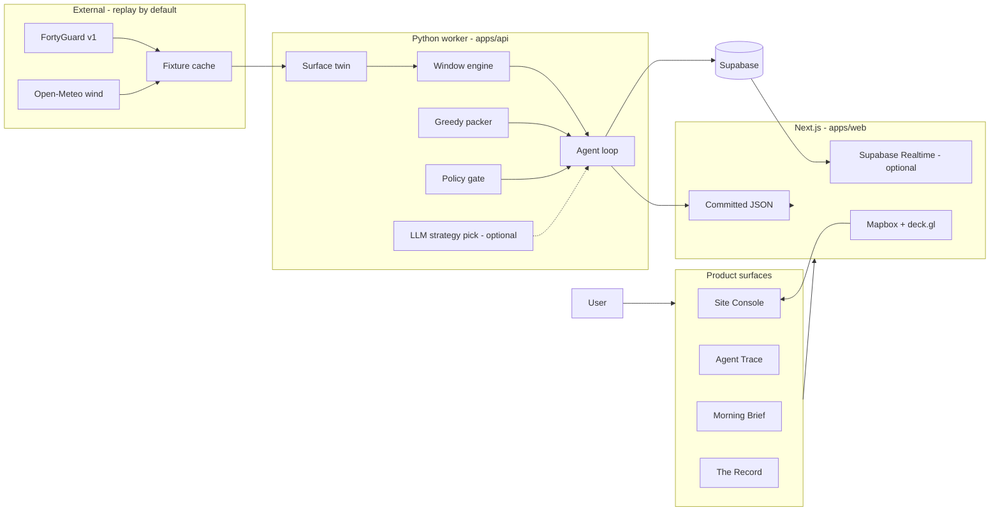
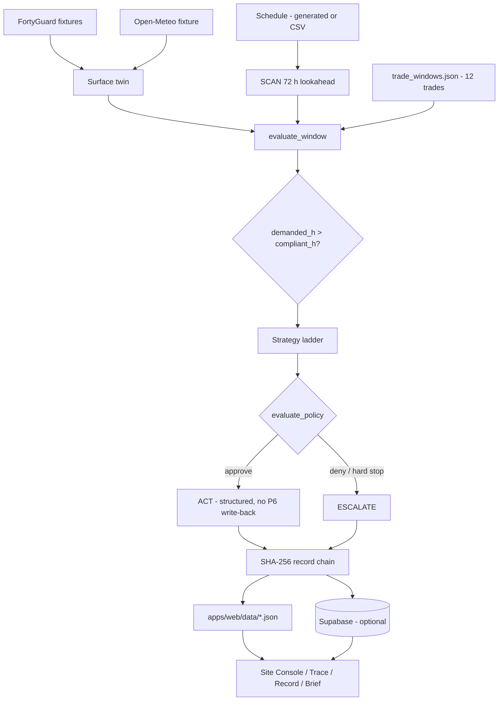

# WORKFACE

**Trade windows at the work face — not the airport.**

A coating spec is not “it was 95 °F.” It is a **window**: substrate ≥ 5 °F above dew point, RH ≤ 85%, an unbroken cure run, a band that closes at different hours on two bays of the same slab, 187.5 m apart. Every trade on a site has a different one, and every one is written against the temperature *at the work face*, not the regional forecast.

WORKFACE reads a construction schedule, translates FortyGuard’s 60 m air-temperature field into the surface / dew-point / WBGT quantities those specs actually govern, finds the hours where nine trades are fighting over five compliant hours, and resequences the day — or escalates when policy says it is not allowed to.

Built for [FortyGuard Hackathon'26](https://fortyguard.com/hackathon26). Primary track: **AI Agents**.

[](https://github.com/siyona-goel/Workface/actions/workflows/ci.yml)
[**Live demo → workface.vercel.app**](https://workface.vercel.app/)

---

## Demo

**Live:** [workface.vercel.app](https://workface.vercel.app/) — Site Console in REPLAY, no login.

| Route | View | Who it is for |
| ----- | ---- | ------------- |
| [`/`](https://workface.vercel.app/) | **Site Console** — 60 m campus map, window ribbon, activity table | superintendent / project controls |
| [`/trace`](https://workface.vercel.app/trace) | **Agent Trace** — replayable SCAN → GATE → ACT log | scheduler / QA |
| [`/conflicts`](https://workface.vercel.app/conflicts) | **Conflict queue** — demanded hours vs compliant hours, by work face | scheduler |
| [`/escalate`](https://workface.vercel.app/escalate) | **Policy gate** — which rule fired, and why | superintendent |
| [`/brief`](https://workface.vercel.app/brief) | **Morning Brief** — phone-sized go / hold / shift cards | area foreman |
| [`/record`](https://workface.vercel.app/record) | **The Record** — SHA-256 hash chain + thermal certificate | warranty / claims |

Toggle **Fixtures** vs **Live run** on Trace (`?src=fixture` / `?src=live`). The hosted app reads committed JSON — Vercel never calls FortyGuard or the LLM. To run the same UI locally, see [Getting Started](#getting-started).

---

## The Problem

Construction specifications are windows, not thresholds. ACI 305 asks whether the evaporation rate stays under 0.2 lb/ft²/hr. SSPC-PA 1 asks whether the *steel* is 5 °F above dew point. Isolatek SFRM asks for an unbroken 24 h run at ≥ 40 °F after placement. Hilti HIT-RE 500 V3 asks how fast the cure clock runs at the *base material* temperature.

None of those quantities is “the temperature in Phoenix.” They are properties of a 60-metre work face, and they disagree with each other. Move the pour to 5 a.m. and you are done — unless that shift puts the coating crew into dawn dew-point convergence, eats four days of float on a near-critical weld, and still cannot guarantee the fireproofing’s 24-hour run.

The scarce resource is not heat. It is **compliant hours**, contended across trades with precedence links between them.

Today the evidence that work was inside its window is a foreman with a surface thermometer writing a number on a paper log. That log is what a warranty adjuster and a delay expert both attack.

---

## The Solution

WORKFACE is a translation layer plus a constrained scheduler plus an accountable agent.

1. **Translate.** FortyGuard supplies a 60 m field of air temperature, humidity, solar (GHI/DNI/DHI) and land cover. A first-order surface energy balance turns that into `T_surf`, dew point and WBGT — the quantities the clauses name.
2. **Evaluate the clause, not the weather.** Twelve trades, seven constraint shapes, every row cited against a published standard or manufacturer PDS.
3. **Pack the day.** A deterministic greedy interval packer places work into open windows under precedence, float and crew capacity. The LLM never computes a date.
4. **Gate every irreversible action.** The agent proposes; YAML-backed Python disposes. Night work, hold points, milestones, out-of-spec application and thin-float near-critical activities escalate instead of auto-approving.
5. **Write the record.** Every flagged package gets an append-only, hash-chained thermal entry with the clause cited and the FortyGuard `activity_id` as provenance.

Outputs are **advisory**. The inspector still puts a probe on the steel.

---

## How It Works

1. A (synthetic) P6-shaped schedule of **328 activities** on **40 work faces** is generated for a real North Phoenix campus (`NPX-FAB-P2`). CSV import is the guaranteed path; XER is optional.
2. FortyGuard `satellite` + `streetview` captures become per-face absorptivity, emissivity and sky-view factor. `heatmap` + `env_params` plus a site-level Open-Meteo wind scalar become hourly `T_air`, `T_surf`, `T_dew`, WBGT.
3. The window engine evaluates each thermal-sensitive activity against its registry row. Result: open / marginal / closed intervals, binding constraint, cited clause, `$ at risk`.
4. Conflicts fire where **demanded productive hours > compliant hours** on the same face and shift.
5. For each resolution target the agent walks a strategy ladder: **split → shift → mitigate → RFI → escalate**. An optional LLM may reorder the ladder and write the rationale; every number still comes from the packer.
6. Gated tools (`shift_activity`, `split_activity`, `notify_crew`) pass `evaluate_policy` or they do not run. Hard-stop denials (hold point, milestone, precedence, stale forecast) escalate immediately.
7. A SHA-256 record chain is written. The Next.js console reads committed JSON (and optionally Supabase Realtime) — it never calls the model.

```
SCAN → EVALUATE → CONFLICT → PROPOSE → GATE → ACT / ESCALATE → RECORD
         ↑ physics + clauses          ↑ LLM optional     ↑ pure Python
```

---

## Architecture

The web app is a reader. The Python worker is the writer. There is **no HTTP API** in this repo: `apps/api` is importable modules and `python -m` CLIs.



| Piece | What it actually does |
| ----- | --------------------- |
| `apps/web` | Next.js 16 console. Imports JSON from `apps/web/data/`. No `app/api` routes. Mapbox token required for the map; everything else renders without it. |
| `apps/api/agent` | Unattended loop + 13-tool surface + policy gate + record chain. Cron entrypoint: `python -m apps.api.agent.worker`. |
| `apps/api/windows` | Seven constraint evaluators + psychrometrics (dew point, ACI 305 evaporation, Q10 cure, WBGT). |
| `apps/api/sequencer` | Greedy interval packer. **Not** CP-SAT. |
| `apps/api/twin` | Surface energy balance from satellite / streetview coefficients. |
| `apps/api/fortyguard` | Async client for `heatmap`, `satellite`, `streetview`, `heat_intelligence`, `env_params`. `REPLAY_MODE=true` by default — never hits the network. |
| `apps/api/climatology` | Tier-0 priors from a 7-year August sweep. Real priors for **three** trades only (see Limitations). |
| Supabase | Optional. Worker upserts `agent_run` / `agent_step` / `record_entry`. Console subscribes to channel `workface-agent`. Fixture replay works with keys unset. |

---

## Key Features

- **Window ribbon.** One lane per activity over a 72 h horizon. Green where every constraint is satisfied, amber where one is marginal, red where it fails, with the reason on hover. The scheduled bar sits on top — when it is not on the green, you can see the problem without reading a number.
- **Hero pair on the same slab.** WF-FAB2-07 (bare, sky-view 0.97) and WF-FAB2-06 (shaded, sky-view 0.45) are **187.5 m** apart on the FAB2 L2 deck. Same coating, same day-window family, windows that differ by more than two hours. The regional forecast is one number for both.
- **Seven constraint types, not seven copies of “too hot.”** Band, dew-point offset, continuity run, Q10 cure clock, composite evaporation rate, decay / compaction clock, and human WBGT work/rest. Concrete touches three of them; coating is an offset problem; SFRM is a 24 h continuity problem.
- **Cross-trade contention.** Conflicts are emitted only where productive demand exceeds open hours on a face+shift — the pour/coating collision on WF-FAB2-11 is the canonical case (5 compliant hours, 12 demanded).
- **Policy gate the model cannot see.** Eight rules in `config/policy.yaml`, evaluated in priority order in pure Python. A fractional float cap exists specifically because an absolute 3-day cap can never fire on an activity that only has 0.6 d of float.
- **Hash-chained thermal record.** `entry.hash = sha256(canonical_json(payload) ‖ prev_hash)`, genesis prev = 64 zeros. Exportable as JSON / CSV / a one-page advisory PDF.
- **Replay-first demo.** Frozen FortyGuard fixtures, wind fixture, and agent runs are the source of truth. Live mode is a deliberate opt-in behind `REPLAY_MODE` and a daily credit cap.

---

## Technical Implementation

### Frontend

Next.js 16, React 19, Tailwind 4, deck.gl 9 over Mapbox GL (`dark-v11`), Recharts for the T_air / T_surf / T_dew chart and the Macropoxy 646 Q10 cure-fit plot.

Data is **committed JSON**, not a live backend. `NEXT_PUBLIC_AGENT_SOURCE` and `?src=` switch Trace between the Day-5 narrative fixture (`agent-run.json`: 328 scanned, 2 conflicts) and the T3 gated-loop run (`agent-run-live.json`: 62 in-window, 11 conflicts, 1 escalation).

Supabase is optional. Missing `NEXT_PUBLIC_SUPABASE_*` keys leave the realtime channel in state `off`; the trace still streams from JSON.

### Backend

Python 3.11 modules. Pydantic v2 schemas in `packages/schemas/` (mirrored as TypeScript types for the UI). No FastAPI, no Flask.

Physics and policy are unit-tested Python on purpose: CI has no model key, and a model outage cannot block a window evaluation.

### Database

SQL migrations under `apps/api/db/migrations/` (PostGIS `work_face`, append-only `record_entry` trigger, `agent_run` / `agent_step`, climatology priors). There is **no migration runner** in the app — apply the SQL to Supabase by hand. Runtime writes go through `apps/api/db/push_run.py` with the service-role key.

### Agents

See [AI / Agent Architecture](#ai--agent-architecture).

### APIs / External Services

| Service | Used for | Replay |
| ------- | -------- | ------ |
| FortyGuard `POST /v1/{heatmap,satellite,streetview,heat_intelligence,env_params}` | 60 m thermal field, land cover, streetview sky fraction, env params | `REPLAY_MODE=true` → content-addressed fixture cache |
| Open-Meteo forecast/archive | Site-level wind scalar at (33.78579, −112.16694) — FortyGuard has no wind field | `data/fixtures/wind_open_meteo.json` |
| Mapbox | Campus map only | n/a (browser token) |
| OpenAI-compatible LLM | Strategy pick + rationale only | Unset env → fixed ladder, CI stays green |
| Supabase | Persist runs; optional Realtime on Trace | Console works without it |

### Infrastructure

- GitHub Actions **CI**: `pytest tests/ -q` on Python 3.11.
- GitHub Actions **agent-cron**: every 4 hours UTC, `REPLAY_MODE=true`, `MAX_FG_CALLS_PER_DAY=0`. Optional `--push-supabase` and `--llm`.
- Frontend on **Vercel**: [workface.vercel.app](https://workface.vercel.app/). No `vercel.json` in-repo; Next.js defaults. Vercel never runs the agent or calls FortyGuard.

---

## AI / Agent Architecture

This is not a chatbot with a weather tool. The loop runs unattended over a work queue it was not handed, discovers contention between activities, and is not allowed to approve its own proposals.

**What the LLM does.** One job, in `apps/api/agent/propose.py`: pick which rung of the strategy ladder to try first (`SPLIT`, `SHIFT`, `MITIGATE`, `RFI`, `ESCALATE`) and write the paragraph a human reads. It never computes a start time, a float, or a window bound.

**What the LLM does not do.** Window evaluation, psychrometrics, packing, policy, hashing. Those are Python. `evaluate_policy` never imports the LLM client.

**Inputs.** 72 h lookahead from `data/project_demo/activities.json` (overlap semantics → 62 in-window / 37 thermal-sensitive), per-face thermal series from the frozen bundle, registry row, crew calendar from `config/crews.yaml`, mock site systems (ready-mix, lighting, heated enclosure).

**Tools** (13 names in `packages/schemas/agent_trace.py`):

| Tool | In the live loop? | Notes |
| ---- | ----------------- | ----- |
| `list_activities_in_lookahead` | yes | SCAN |
| `get_work_face_thermal` | yes | EVALUATE |
| `evaluate_window` | yes | deterministic |
| `propose_resequence` | via packer | greedy `pack()` |
| `request_mitigation` | yes | catalog in `data/mitigations/` |
| `raise_rfi` / `escalate_to_superintendent` | trace | strategy ladder |
| `shift_activity` / `split_activity` / `notify_crew` | gated stubs | return structured results; **do not write back to P6** |
| `get_trade_window` / `get_schedule_context` | implemented | tests; not called from the loop |
| `write_record` | via `record.build_chain` | not a `StepType.RECORD` step |

**How decisions are made.** Fixed order `SPLIT → SHIFT → MITIGATE → RFI → ESCALATE` unless `llm_choose_strategy()` returns a permutation. Each gated rung builds a `GateContext` and calls `evaluate_policy`. First non-approve verdict wins. Hard-stop rule ids (`no_move_inspection_hold_point`, `no_move_past_milestone`, `no_precedence_violation`, `fail_closed_on_stale_forecast`) skip the rest of the ladder.

**Policy rules** (priority order, `config/policy.yaml`):

1. Fail closed on missing / stale (> 2 h) forecast
2. No precedence violation
3. No move of an inspection hold point
4. No move past a contractual milestone
5. No out-of-spec application (RFI only)
6. Max float consumed — **3.0 d absolute or 100% of that activity’s own float**
7. No auto night work (19:00–05:00 site-local)
8. Escalate if WBGT work fraction < 0.5

**Fallback.** LLM env unset → `model_name = "none (deterministic proposer…)"`, `replay=true`. Transport errors retry 3× then fall back to the fixed order. `Verdict.NO_DATA` is counted separately and never folded into `flagged_count`.

**Provider.** One OpenAI-compatible client, three env vars, no provider branching. Ollama locally, or any hosted `/v1` endpoint. See `docs/LLM_SETUP.md`. The Next.js app **never calls the model**.

Committed live-loop summary (`data/fixtures/agent_run_summary.json`): scanned 62, flagged 22, 11 conflicts, 11 resolved, 1 escalated, 22 record entries, chain verified.

---

## Data Flow



Three temporal tiers, only the last two of which are on the demo surfaces:

| Tier | Horizon | Source | Role |
| ---- | ------- | ------ | ---- |
| 0 Plan | years of August history | heatmap `filter_type: 4`, 2019–2025 | climatological **probability** a window is open — not a forecast |
| 1 Commit | next 72 h in the demo (API forecast is 12 h) | live heatmap + env_params, frozen for demo | go / no-go the superintendent can still act on |
| 2 Record | after the fact | hash chain + certificate export | warranty / delay evidence |

---

## Example / Walkthrough

Demo site: **North Phoenix Advanced Packaging Facility — Phase 2** (`NPX-FAB-P2`). Geography is real. The 328-activity schedule is generated (`seed: 20260820`). Standards are real. The 24–27 Aug 2026 window is the commit horizon.

**1. Open the Console.** Forty work faces colour by worst verdict. Cyan outlines mark the hero pair on FAB2 L2.

**2. Read the ribbon, not a forecast.** Shaded bay B2 (WF-FAB2-06, A-1059, high-build epoxy): window opens **05:40**, closes **09:20**. Bare bay C2 (WF-FAB2-07, A-1069), 187.5 m away: window opens **05:00**, closes **07:20**. Click a lane → T_air / T_surf / T_dew with the SSPC-PA 1 + 2.8 °C offset drawn as a band, Macropoxy 646 clause quoted inline.

**3. Morning Brief, same facts in a pocket.** “Deck B2 coating: window opens 05:40. Equipment pad pour A-1205 moved to 05:00. Fireproofing A-1088 on hold — no compliant 24 h run before 28 Aug.”

**4. Trace the agent.** Fixture narrative (`?src=fixture`): scan 328 → flag 41 → two conflicts on WF-FAB2-11.

- **C1 (24 Aug).** Slab pour A-2003 (8 h) and epoxy A-2009 (6 h) both want 05:00–10:00. Five open hours, twelve demanded. The agent finds a **split** instead of shoving the pour into the coating’s dew-point closure.
- **C2 (25 Aug).** Slipping the coating into the next clean window would push near-critical deck weld A-2006 and consume **four days of float**. The gate denies; the agent **escalates** with the tradeoff written out.

**5. Open Escalate.** The verdict names the rule (`max_float_days_consumed` or `no_move_inspection_hold_point`), the number, and the requirement — not “policy denied.”

**6. Open The Record.** 22 hash-chained entries for the live loop, chain head verified in the browser via Web Crypto. Export path: `python -m apps.api.export.certificate`.

---

## Getting Started

### Prerequisites

- **Python 3.11** (CI version)
- **Node 20+** (Next.js 16)
- A Mapbox public token if you want the campus map (`pk.…`)
- LLM and FortyGuard keys are **optional**. Replay works without them.

### Installation

From the repo root:

```bash
python -m venv .venv
# Windows: .venv\Scripts\activate
# macOS/Linux: source .venv/bin/activate
pip install -r apps/api/requirements.txt

cd apps/web
npm install
cd ../..
```

### Environment Variables

Copy `.env.example` to `.env` at the **repo root** (Python / worker). For the Next.js app, copy the `NEXT_PUBLIC_*` rows into `apps/web/.env.local` — Next does not read the root `.env`.

| Variable | Purpose | Required |
| -------- | ------- | -------- |
| `REPLAY_MODE` | `true` (default) = never call FortyGuard or Open-Meteo | no (defaults true) |
| `FORTYGUARD_API_KEY` | Live FortyGuard calls | only if `REPLAY_MODE=false` |
| `MAX_FG_CALLS_PER_DAY` | Credit cap (default 120; cron sets 0) | no |
| `NEXT_PUBLIC_MAPBOX_TOKEN` | Campus map | for the map only |
| `NEXT_PUBLIC_AGENT_SOURCE` | Default Trace source: `fixture` or `live` | no (defaults `fixture`) |
| `NEXT_PUBLIC_SUPABASE_URL` | Browser Supabase client | no |
| `NEXT_PUBLIC_SUPABASE_ANON_KEY` | Browser Supabase client | no |
| `SUPABASE_URL` | Worker upserts | for `--push-supabase` |
| `SUPABASE_SERVICE_KEY` | Worker service-role key | for `--push-supabase` |
| `LLM_BASE_URL` | OpenAI-compatible endpoint | for `--llm` |
| `LLM_API_KEY` | Any non-empty string (Ollama ignores the value) | for `--llm` |
| `LLM_MODEL` | e.g. `qwen3:8b` | for `--llm` |
| `WIND_FEED_URL` | Override Open-Meteo | no |
| `DATABASE_URL` | `apps/api/db/seed.py` only | no |

Do not commit `.env` or `.env.local`.

### Run locally

**Terminal 1 — UI** (this is the demo):

```bash
cd apps/web
npm run dev
```

Open [http://localhost:3000](http://localhost:3000). Console, Trace, Conflicts, Escalate, Brief and Record all load from JSON with no Python process running.

**Terminal 2 — agent worker** (optional; regenerates live fixtures):

```bash
# from repo root, venv active
python -m apps.api.agent.worker
# with LLM strategy pick:
python -m apps.api.agent.worker --llm
# push to Supabase:
python -m apps.api.agent.worker --push-supabase
```

**Tests** (from repo root — `conftest.py` puts the root on `sys.path`):

```bash
pytest tests/ -q
```

LLM tests skip cleanly when `LLM_*` are unset.

**Certificate export:**

```bash
python -m apps.api.export.certificate
# writes data/exports/certificate_<run_id>.{json,csv,pdf}
```

**Schedule import** (CSV guaranteed; XER needs optional `xerparser`):

```bash
python -m apps.api.schedule.importer --csv data/project_demo/schedule_export.csv --write
```

---

## Project Structure

```
apps/web/                 Next.js console (reader)
  app/                    routes: / /trace /conflicts /escalate /brief /record
  components/             map, ribbon, drawer, trace, record, brief
  data/                   UI fixtures (console, ribbon, agent runs, record chain)
apps/api/                 Python worker (writer) — not an HTTP server
  agent/                  loop, tools, policy, propose, record, worker
  windows/                registry, 7 evaluators, psychrometrics
  sequencer/              greedy packer
  twin/                   surface energy balance
  fortyguard/             client, cache, credits, AOI
  climatology/            Tier-0 priors
  export/                 thermal certificate
  db/                     SQL migrations, Supabase push
packages/schemas/         Pydantic + TS contracts
config/                   policy.yaml, crews.yaml, budget.yaml
data/
  project_demo/           328 activities, 40 work faces, stats
  trade_windows.json      12-trade registry with citations
  fixtures/               frozen FortyGuard / wind / agent / record
  exports/                sample certificate
tests/                    24 pytest modules
docs/                     ASSUMPTIONS, CITATIONS, LLM_SETUP, PILOT
```

---

## Deployment

| Layer | What the repo shows |
| ----- | ------------------- |
| Frontend | [workface.vercel.app](https://workface.vercel.app/) — Next.js `apps/web` on Vercel. Set every `NEXT_PUBLIC_*` var in the Vercel project; local `.env` does not travel. No `vercel.json` in-repo. |
| Agent | GitHub Actions `agent-cron.yml`, every 4 h, always `REPLAY_MODE=true`. |
| Database | Supabase (Postgres + Realtime). Apply `apps/api/db/migrations/*.sql` manually. Worker needs `SUPABASE_URL` + `SUPABASE_SERVICE_KEY`. |
| LLM | Not on Vercel. Laptop or Actions secrets (`LLM_BASE_URL` / `LLM_API_KEY` / `LLM_MODEL`). |

The committed cron workflow injects `SUPABASE_SERVICE_ROLE_KEY`; the Python client reads `SUPABASE_SERVICE_KEY`. Map the secret to the name the worker expects if you enable `--push-supabase`.

---

## Challenges & Engineering Decisions

**Challenge:** Specs govern surface temperature, dew-point offset and cure integrals. The sponsor API publishes 2 m air temperature.

**Approach:** A first-order energy balance, coefficients derived from FortyGuard satellite land cover and streetview sky fraction:

`T_surf = T_air + (α · GHI · ψ − ε · Q_lw · (1 − cloud/8)) / (h_c(V) + h_r)`

`shadow` is dropped (it is an image artefact, not a material). Unsegmented back hemisphere downgrades confidence one step. ε for weathered galvanised deck is 0.85 — the dawn coating closure lives or dies on that number, and the sensitivity is published in `docs/ASSUMPTIONS.md`.

**Why it matters:** Without the twin, this is a coloured weather map. With it, two faces on the same slab get different windows.

---

**Challenge:** An LLM that both proposes and approves will happily void a manufacturer warranty or spend a near-critical activity’s entire float.

**Approach:** The agent proposes; `apps/api/agent/policy.py` disposes. The model cannot edit `config/policy.yaml` and cannot see the gate internals. Gated tools are unreachable without a preceding `GateVerdict`. Split is tried *before* shift so the demo beat — find a split instead of an expensive dawn pour — is a property of the ladder, not a prompt.

**Why it matters:** This is what “agentic” has to mean on a construction site: unattended, consequential, and not allowed to do certain things.

---

**Challenge:** FortyGuard forecasts 12 hours. Superintendents plan in three-week look-aheads. Live API credits also run out mid-hackathon.

**Approach:** Three tiers (climatology / commit / record), AOI clustering, 100 m for the historical sweep and 60 m only for flagged faces, historical cache forever, `REPLAY_MODE=true` as the demo default, daily call cap that fails at 80%. The demo never makes a live FortyGuard call.

**Why it matters:** The 12-hour horizon becomes a commit window, not a product apology — and the stage demo does not depend on conference wifi.

---

**Challenge:** An absolute float cap of 3 days can never fire on the activities that most need protection (A-1237 has 0.6 d of float).

**Approach:** Two thresholds on one rule: 3.0 d **or** 100% of *that activity’s* float. Productive hours (post-WBGT haircut), not clock hours, are what the packer packs against. `NO_DATA` fails closed instead of counting as a risk flag.

**Why it matters:** The gate is using CPM vocabulary on purpose. A thin-float near-critical path is exactly where a silent auto-shift would be most expensive.

---

**Challenge:** Construction judges will ask whether the schedule is fake and whether the model replaces a probe.

**Approach:** Label it. “Synthetic schedule, real geography, real standards.” Every registry row carries `verify_status` (`primary` / `secondary` / `partial`) and a source URL. The UI and the certificate both say **advisory — not a substitute for field measurement**.

**Why it matters:** Visible restraint is more credible than a warranty claim the standards themselves forbid.

---

## Limitations

- **Advisory, not certifying.** Does not replace inspection, the engineer of record, or the surface thermometer the cited standards require.
- **The schedule is synthetic.** 328 activities, generated. Float, milestones and sequencing are illustrative.
- **No P6 write-back.** Shift/split/notify tools return structured results and record material. The schedule of record is untouched.
- **No wind field.** Wind is one site-level Open-Meteo scalar. Evaporation, WBGT, convection and the TMS 602 masonry trigger are therefore not spatially resolved.
- **Surface model is a model.** Calibrated from published α/ε ranges, not a field probe. Hero dawn closure assumes a clear, dry, calm August dawn (humid monsoon cloud shrinks the longwave undershoot).
- **Climatology priors exist for three trades** (hot-weather concrete, cold-weather concrete, SFRM). The historical sweep only queried 35 °C and 4 °C. Other trades get `p_open = None` / `insufficient_threshold` — no interpolation.
- **12 hand-curated US trades** (registry `2026.08.20-a`). A real project needs that project’s approved product data sheets.
- **Certificate hourly series in the PDF body is synthetic.** The hash chain and clause citation are real; wiring the thermal bundle into the PDF is not done yet.
- **WBGT work/rest bands are WORKFACE placeholders** pending ACGIH licence (the ACGIH table is copyrighted).
- **One project, one site, US practice.** Multi-project portfolios, BIM/IFC, IoT sensors, and anything outside the United States are out of scope.
- **No HTTP API and no Docker.** The UI is hosted on Vercel; the agent worker is not.

The same list, written for the product, lives in [`docs/ASSUMPTIONS.md`](docs/ASSUMPTIONS.md).

---

## Future Improvements

- Replace the greedy packer with CP-SAT on the same interval formulation (deliberately not started).
- Sweep the remaining registry thresholds so Tier-0 priors cover coating, masonry, sealant — not just 35 °C / 4 °C.
- Feed the real thermal bundle into the certificate PDF instead of the synthetic 12-hour series.
- Load the project’s submittal-register PDS in place of the 12-row demo registry.
- A 90-day single-GC pilot — integration surface, success metrics, and what we refuse to claim — is in [`docs/PILOT.md`](docs/PILOT.md).

---

## Team

Three-person hackathon team, split by surface:

| Role | Owned |
| ---- | ----- |
| **Siyona** | Product surface — Next.js console, ribbon, map, Trace / Record / Brief |
| **Ky** | External services — FortyGuard client, fixtures, credits, cron, certificate export |
| **Aashma** | Domain — registry, evaluators, twin, sequencer, policy gate, record chain |

---

*WORKFACE plans and records thermal work-windows. It does not certify. FortyGuard Hackathon'26.*
