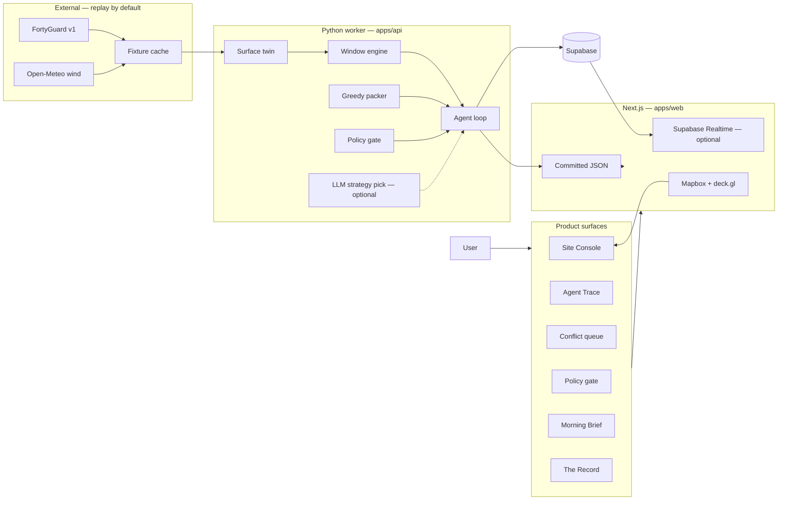
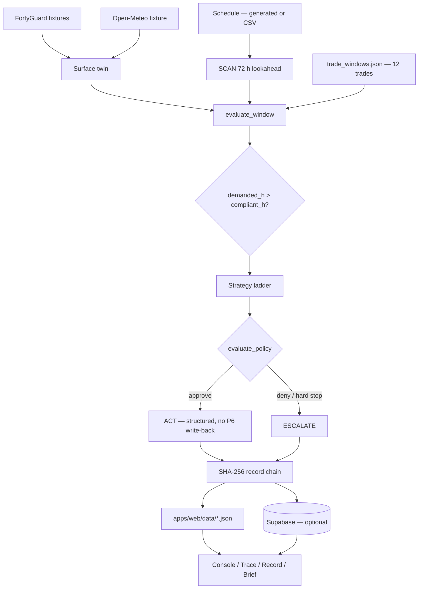
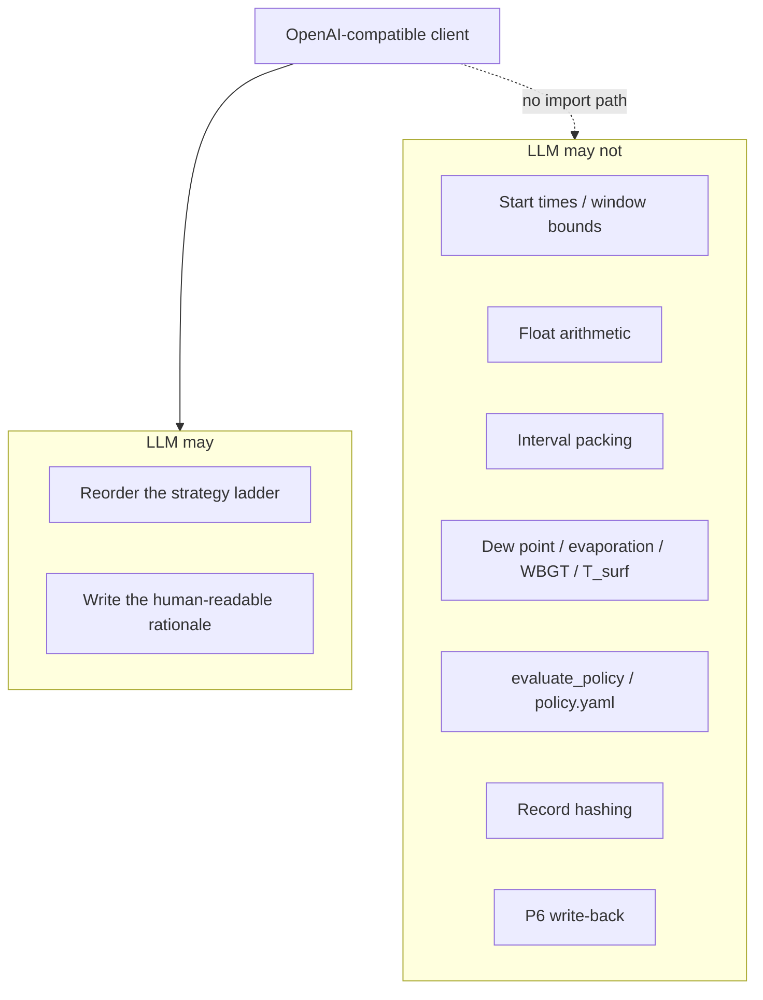

# WORKFACE Architecture

*As built for FortyGuard Hackathon'26. Advisory: plans and records thermal work-windows; does not certify and does not replace field measurement.*

This document describes the running system: what talks to what, which process is allowed to write, and which numbers the model is forbidden from computing. Product narrative and setup live in the [README](../README.md). Assumptions and coefficients live in [ASSUMPTIONS.md](ASSUMPTIONS.md).

---

## 1. Shape of the system

WORKFACE is two processes with a file (and optional database) between them.

| Process | Role | Runtime |
| ------- | ---- | ------- |
| **Python worker** (`apps/api`) | Writer. Ingests schedule and thermal field, evaluates windows, packs intervals, runs the agent, hashes the record. | Laptop, GitHub Actions cron. `python -m` CLIs. **Not an HTTP server.** |
| **Next.js console** (`apps/web`) | Reader. Renders committed JSON (and optionally a Supabase Realtime channel). | Vercel / `next dev`. **No `app/api` routes. Never calls FortyGuard or the LLM.** |

There is no FastAPI, no Flask, no Docker, and no in-repo HTTP API. `apps/api` is importable modules plus command-line entrypoints. The hosted demo never needs the worker running.

```
SCAN → EVALUATE → CONFLICT → PROPOSE → GATE → ACT / ESCALATE → RECORD
         ↑ physics + clauses          ↑ LLM optional     ↑ pure Python
```

The scarce resource is **compliant hours at a 60 m work face**, contended across trades with precedence links. The architecture exists to evaluate the *clause*, pack the *day*, and refuse to auto-approve the moves that would void a warranty or spend a near-critical activity's float.

---

## 2. Design principles

1. **The web app is a reader. The Python worker is the writer.** UI state is committed JSON under `apps/web/data/`. Regenerating it is a worker / script job, not a browser fetch.
2. **Replay first.** `REPLAY_MODE=true` is the default. FortyGuard and Open-Meteo are never hit unless someone opts in. The stage demo does not depend on conference wifi or remaining API credits.
3. **The agent proposes; Python disposes.** Window evaluation, psychrometrics, packing, policy, and hashing never import the LLM client. `evaluate_policy` cannot see the model. The model cannot edit `config/policy.yaml`.
4. **Fail closed.** Missing series, stale forecast (> 2 h), unsegmented twin inputs, and unswept climatology thresholds produce `NO_DATA` / escalate — never a guessed open window.
5. **Cite everything.** Registry rows, record entries, and gate verdicts carry a clause, a standard, or a named rule id. Uncited registry rows are rejected by Postgres (`citation` `NOT NULL` + length check) and by tests.
6. **Advisory, not certifying.** Shift / split / notify return structured results and record material. They do **not** write back to P6. The inspector still puts a probe on the steel.

---

## 3. System context



---

## 4. Repository map

```
apps/web/                 Next.js 16 console (reader)
  app/                    /  /trace  /conflicts  /escalate  /brief  /record
  components/             map, ribbon, drawer, trace, record, brief
  data/                   UI fixtures copied from worker output
  lib/                    typed loaders; optional Supabase client
apps/api/                 Python worker (writer) — not an HTTP server
  agent/                  loop, tools, policy, propose, record, llm, worker
  windows/                registry, 7 evaluators, psychrometrics, evaluate_window
  sequencer/              greedy interval packer (not CP-SAT)
  twin/                   surface energy balance (transform of T2 capture)
  fortyguard/             async client, cache, credits, AOI, sweep, twin capture
  climatology/            Tier-0 priors from the historical sweep
  schedule/               CSV/XER importer (T2) + synthetic generator (T3)
  sitefeeds/              Open-Meteo wind + mock site systems
  export/                 thermal certificate JSON / CSV / PDF
  db/                     SQL migrations + Supabase push
packages/schemas/         Pydantic v2 + Zod contracts (snake_case wire format)
config/                   policy.yaml, crews.yaml, budget.yaml
data/
  project_demo/           328 activities, 40 work faces, site geometry
  trade_windows.json      12-trade registry with citations
  fixtures/               frozen FortyGuard / wind / agent / record
  aoi/                    tile clusters (≤ 5 heatmap polygons)
  exports/                sample certificate
tests/                    24 pytest modules
docs/                     this file, ASSUMPTIONS, CITATIONS, LLM_SETUP, PILOT
.github/workflows/        ci.yml (pytest) · agent-cron.yml (every 4 h, replay)
```

Ownership is by **boundary**, not topic: the Next.js app is one owner; anything that talks to an external service or file format is another; anything that transforms data already on disk is a third. Split folders (`schedule/`, twin capture vs `twin/surface.py`, historical sweep vs `climatology/priors.py`) sit on the fetch/transform line on purpose.

---

## 5. Naming rule

FortyGuard calls its async job an `activity_id`. Construction calls a scheduled task an activity. They collide if blurred.

| Name | Meaning |
| ---- | ------- |
| `activity_id` | A scheduled construction task (P6 / generator). Lives on `activity`, the ribbon, the trace, the record. |
| `fg_activity_id` | A FortyGuard async job handle from `POST /v1/{endpoint}` → `/v1/status/{id}`. Provenance on thermal series and record payloads. |

The rule is written at the top of `packages/schemas/__init__.py` and repeated in every contract module. The two ids live in different Postgres tables (`activity` vs `fg_activity`).

Site-local time is **America/Phoenix, UTC−07:00, no DST**. ISO-8601 with offset on every timestamp in the contracts.

---

## 6. Shared contracts

`packages/schemas/` is the one shared folder. Pydantic v2 (Python) and Zod (TypeScript) sit side by side, field-for-field, **snake_case on the wire**. Changing a field is a PR that tags the other owners; silent renames are forbidden.

The Next.js app does **not** import the Zod files at runtime. It reads committed JSON through local types in `apps/web/lib/*`. The Zod modules are the contract of record so the worker and the UI cannot drift silently.

| Module | Handoff | What it is |
| ------ | ------- | ---------- |
| `activity` | T3 → T2 | Canonical schedule: activities, work faces, FS/SS/FF/SF links, float, milestones, hold points |
| `thermal_series` | T2 → T3 | Hourly `T_air` + env params + site wind, plus `fg_activity_id`s |
| `historical_readings` | T2 → T3 | Raw 7-year August sweep → climatology priors |
| `twin_segmentation` | T2 → T3 | Raw `satellite` + `streetview` per face |
| `window_eval` | T3 → T1 | **Ribbon contract:** hour cells, open intervals, binding constraint, verdict, citation, `$` exposure |
| `agent_trace` | T3 → T1 | Replayable SCAN → … → ACT/ESCALATE log, 13 tool names, gate verdict |
| `record` | T3 → T1 / T2 | Hash-chained payload + certificate shape. Canonical `compute_entry_hash` lives here |
| `trade_window` | T3, read by all | Typed rows of `data/trade_windows.json` |

`window_eval` is the only thing the ribbon needs. It was published with hand-written fixtures so the UI could ship before the maths existed.

---

## 7. End-to-end pipeline



### 7.1 Ingest

- **Synthetic schedule** (demo): `apps/api/schedule/generator.py` → `data/project_demo/activities.json` + `work_faces.geojson`. 328 activities, 40 work faces, site `NPX-FAB-P2`, seed `20260820`. Geography is real; the programme is labelled synthetic.
- **Import path** (guaranteed): `python -m apps.api.schedule.importer --csv … --write`. XER is optional (`xerparser` / PyP6Xer). Both emit the same `ProjectSchedule` shape.
- **AOI clustering**: 40 faces → 3–5 heatmap polygons (`apps/api/fortyguard/aoi.py`). FAB2 (hero deck) and ROAD (linear asphalt) stay unmerged so a bbox cannot swallow empty acres. Budget in `config/budget.yaml`: 100 m for the planning sweep, 60 m for commit / hero faces, daily FortyGuard cap 120 with fail-loud at 80%.

### 7.2 Work-face thermal twin

FortyGuard publishes **2 m air temperature**. Specs govern **surface / dew point / base material / WBGT**. The twin is the translation layer.

`apps/api/fortyguard/twin_capture.py` fetches `satellite` + `streetview` once per face (cached forever). `apps/api/twin/surface.py` derives coefficients:

```
T_surf = T_air + (α · GHI · ψ − ε · Q_lw · (1 − cloud/8)) / (h_c(V) + h_r)
h_c(V) = 5.7 + 3.8 · V     h_r ≈ 5 W/m²K
```

Honesty rules encoded in code, not comments:

- **`shadow` is dropped** and remaining land-cover fractions renormalised. It is an image artefact, not a material, and treating it as reduced insolation would assert the shadow at every hour.
- **Unsegmented back hemisphere** (true for all 40 demo captures) **downgrades confidence one step**. `psi` is a single-hemisphere sky fraction presented as whole-sky.
- **ε for weathered galvanised deck is 0.85.** The hero dawn dew-point closure is the `ε · Q_lw` undershoot; sensitivity is published in [ASSUMPTIONS.md](ASSUMPTIONS.md).

### 7.3 Thermal field

| Input | Source | Spatial grain |
| ----- | ------ | ------------- |
| `T_air`, RH, wet bulb, GHI/DNI/DHI, cloud, elevation | FortyGuard `heatmap` + `env_params` | 60 m tile / AOI |
| Land cover, sky fraction | `satellite` + `streetview` | per work face |
| Wind | Open-Meteo at (33.78579, −112.16694) | **site-level scalar** — not a field |

`apps/api/sitefeeds/wind.py` is explicit: evaporation, WBGT, convection, and the TMS 602 masonry trigger are therefore not spatially resolved. Replay reads `data/fixtures/wind_open_meteo.json`.

The assembled per-face series is `ThermalSeriesBundle` (`data/fixtures/sample_thermal_bundle.json`). Each series carries the `fg_activity_id`s it rests on.

### 7.4 Window engine

`evaluate_window` (`apps/api/windows/evaluate.py`) is pure Python over an in-memory series. No I/O beyond the cached registry, no network, no LLM.

It dispatches every constraint on the trade's registry row, intersects the results into a dense hour ribbon (`open` / `marginal` / `closed` / `no_data`), extracts open intervals (with a **productive-hour** haircut from the human/WBGT evaluator), names the **binding constraint** by leave-one-out, and rolls up a `Verdict` against the scheduled bar.

`NO_DATA` fails closed and is counted separately from `flagged_count`. A continuity run that extends past the 72 h horizon is the common case.

Psychrometrics (`apps/api/windows/psychro.py`): Magnus–Tetens dew point, ACI 305 / Menzel–NRMCA evaporation, Q10 cure clock, Nurse–Saul maturity, and a first-order globe WBGT labelled `workface_simplified_globe_v1` — **not** Liljegren. Golden tests in `tests/test_psychro.py`.

### 7.5 Sequencer

`apps/api/sequencer/pack.py` is a **greedy interval packer**. It is not CP-SAT (deliberately not started). The LLM never sees an interval.

1. Topological sort by precedence.
2. Tightest-float-first within that order.
3. Place each activity in its earliest feasible open interval: precedence + lag, crew capacity from `config/crews.yaml`, duration measured in **productive hours** (`OpenInterval.productive_h`), not clock hours.
4. Backtrack one level on failure (bump the previous activity to its next-later interval once).

Outcomes: `placed` · `placed_float_spent` · `unplaceable`. Unplaceable is named (`no_open_interval`, `insufficient_productive_hours`, `precedence_blocked`, `crew_unavailable`) and is the input to escalation — provable infeasibility, not a crash.

### 7.6 Agent loop → record → surfaces

Covered in §11–§13 and §15. Entry point for unattended runs:

```bash
python -m apps.api.agent.worker              # fixtures only
python -m apps.api.agent.worker --llm        # strategy pick
python -m apps.api.agent.worker --push-supabase
```

`worker.py` always sets `REPLAY_MODE=true` if unset, runs `run_unattended`, writes `data/fixtures/agent_run_live.json`, `record_chain_live.json`, `agent_run_summary.json`, and optionally upserts to Supabase.

---

## 8. Seven constraint types

The registry (`data/trade_windows.json`, version `2026.08.20-a`) is organised by **constraint shape**, not by trade. Twelve US trades, a citation and `verify_status` (`primary` / `secondary` / `partial`) on every row.

| Type | Shape | Example |
| ---- | ----- | ------- |
| **Band** | `T_min ≤ T_gov(t) ≤ T_max` | Masonry, sealant, traffic paint, concrete discharge |
| **Offset** | `T_surface(t) ≥ T_dew(t) + Δ` | Protective coatings (SSPC-PA 1, Δ = 2.8 °C) |
| **Continuity** | Compliant run ≥ N hours from placement | SFRM 24 h ≥ 40 °F; ACI 306 protection |
| **Cure clock** | `∫ f(T) dt ≥ 1` | Epoxy anchors, coating recoat, concrete maturity |
| **Composite rate** | Derived rate ≤ limit | ACI 305 evaporation ≤ 0.2 lb/ft²/hr |
| **Decay clock** | Available minutes = f(base temperature) | Asphalt compaction window |
| **Human** | WBGT → work/rest → effective crew hours | OSHA / ACGIH-shaped bands (placeholders pending licence) |

Concrete touches three of these. That is what makes the product multi-trade in substance: moving a pour into the dawn band is free until it closes the coating offset and breaks the fireproofing continuity run.

Dispatchers live in `apps/api/windows/constraints.py`. A missing type raises; it does not skip.

---

## 9. Three temporal tiers

FortyGuard forecasts **12 hours**. Superintendents plan in weeks. The product is three loops, only the last two of which are on the demo surfaces.

| Tier | Horizon | Source | Role |
| ---- | ------- | ------ | ---- |
| **0 Plan** | Years of August history (2019–2025) | `heatmap` `filter_type: 4`, exceedance **and** persistence, both directions | Climatological **probability** a window is open — not a forecast. UI must say so. |
| **1 Commit** | Next 72 h in the demo (API forecast is 12 h) | Frozen heatmap + `env_params` | Go / no-go the superintendent can still act on |
| **2 Record** | After the fact | Hash chain + certificate export | Warranty / delay evidence |

Tier-0 priors exist for **three trades only**: hot-weather concrete (exceedance above 35 °C), cold-weather concrete (exceedance below 4 °C), SFRM (persistence below 4 °C). Every other trade gets `p_open = None` / `coverage = insufficient_threshold`. No interpolation. The coating row's `t_min_f = 35` is never joined to the sweep's 35 **Celsius**.

Hour-of-day on the hot band is **modelled** from a diurnal shape calibrated to observed exceedance counts (`hour_of_day_source = "modelled"`). The count is observed; the timing is not. `TileReading.hourly_tcm_c` is empty on the current sweep.

---

## 10. Agent architecture

This is not a chatbot with a weather tool. The loop runs unattended over a work queue it was not handed, discovers contention, and is not allowed to approve its own proposals.

### 10.1 Loop

`apps/api/agent/loop.py` → `run_agent()`. Lookahead: 72 h from `2026-08-24T00:00−07:00`, **overlap** semantics (planned window intersects the horizon) → 62 in-window / 37 thermal-sensitive on the live run.

| Stage | What happens |
| ----- | ------------ |
| **SCAN** | `list_activities_in_lookahead` |
| **EVALUATE** | `get_work_face_thermal` → `evaluate_window` (deterministic) |
| **CONFLICT** | Group by work face + shift day. Emit a `Conflict` where **productive demanded hours > open clock hours** |
| **PROPOSE** | Strategy ladder per resolution target (cap 12: near-critical, hold-point, then conflict participants, tightest float first) |
| **GATE** | `evaluate_policy` on gated rungs |
| **ACT** or **ESCALATE** | Structured tool result, or route to a human with the tradeoff written out |

`StepType.VERIFY` and `StepType.RECORD` exist on the contract. The live loop does **not** emit them as trace steps: VERIFY is implicit in the packer's projected placement; RECORD is a separate chain built by `apps/api/agent/unattended.py` after the loop returns.

Committed live-loop summary (`data/fixtures/agent_run_summary.json`): scanned 62, flagged 22, 11 conflicts, 11 resolved, 1 escalated, 22 record entries, chain verified.

The Day-5 **narrative fixture** (`apps/web/data/agent-run.json`: scan 328, 2 conflicts on WF-FAB2-11) is a demo script, not a re-run of this loop. Trace `?src=fixture` vs `?src=live` switches between them. The live loop's contention lands on BULK / CHEM / WHSE, not the FAB2 hero deck (one thermal activity in-window on WF-FAB2-11).

### 10.2 What the LLM does — and does not

One job, in `apps/api/agent/propose.py`: pick which rung of the strategy ladder to try first and write the paragraph a human reads.

It never computes a start time, a float, a window bound, a hash, or a gate verdict.

`apps/api/agent/llm.py` is **one** OpenAI-compatible client, three env vars (`LLM_BASE_URL`, `LLM_API_KEY`, `LLM_MODEL`), **no provider branching**. Ollama locally or any hosted `/v1`. Prompts are designed without `tool_choice` (Ollama's compatible endpoint does not support it). See [LLM_SETUP.md](LLM_SETUP.md).

Unset env → `model_name = "none (deterministic proposer…)"`, `replay=true`, fixed ladder. Transport errors retry 3× then fall back to the same. CI has no model key; `tests/test_llm_smoke.py` skips cleanly.

### 10.3 Strategy ladder

Fixed order, because the demo beat (find a split instead of an expensive dawn pour) is a property of the ladder, not a prompt:

```
SPLIT → SHIFT → MITIGATE → RFI → ESCALATE
```

The LLM may return a permutation. Each gated rung builds a `GateContext` and calls `evaluate_policy`. First non-approve verdict wins. Hard-stop rule ids skip the rest of the ladder:

- `no_move_inspection_hold_point`
- `no_move_past_milestone`
- `no_precedence_violation`
- `fail_closed_on_stale_forecast`

### 10.4 Tool surface

Thirteen names in `packages/schemas/agent_trace.py` `ToolName`. Implementations in `apps/api/agent/tools.py` and call sites in the loop / proposer.

| Tool | In the live loop? | Notes |
| ---- | ----------------- | ----- |
| `list_activities_in_lookahead` | yes | SCAN |
| `get_work_face_thermal` | yes | EVALUATE |
| `evaluate_window` | yes | deterministic |
| `propose_resequence` | via packer | greedy `pack()` |
| `request_mitigation` | yes | catalog in `data/mitigations/` + `MockSiteSystems` |
| `raise_rfi` / `escalate_to_superintendent` | yes | ladder rungs |
| `shift_activity` / `split_activity` / `notify_crew` | gated stubs | **require an approving `GateVerdict`**; do not write back to P6 |
| `get_trade_window` / `get_schedule_context` | implemented | tests; not called from the loop |
| `write_record` | via `record.build_chain` | not a `StepType.RECORD` step |

`require_approval` is the wall: a gated tool invoked without a verdict, or with a non-approve verdict, raises `GateError`. `tests/test_tools.py` proves it.

Site systems (`apps/api/sitefeeds/sitesystems.py`) are **mocks**: crew calendar, ready-mix slots, lighting plan, heated-enclosure inventory. They make actions feel consequential without claiming a live integration.

---

## 11. Policy gate

`apps/api/agent/policy.py` reads `config/policy.yaml`. Pure functions `(ctx, cfg) → GateVerdict | None`. `evaluate_policy` runs them in **priority order** and returns the first non-approve verdict, or approve if every rule passes. The reason on every verdict names the number and the requirement, not "policy denied."

Rule ids `split_within_float_ok` and `max_float_days_consumed` are a contract with the escalation UI and must not be renamed.

| Priority | Rule id | Behaviour |
| -------- | ------- | --------- |
| 1 | `fail_closed_on_stale_forecast` | Missing or > 2 h old series → deny + escalate |
| 2 | `no_precedence_violation` | Coating a substrate that has not cured, etc. |
| 3 | `no_move_inspection_hold_point` | Pour that needs a city inspector |
| 4 | `no_move_past_milestone` | Contractual milestone (e.g. MS-340) |
| 5 | `no_out_of_spec_application` | Outside manufacturer window → RFI only |
| 6 | `max_float_days_consumed` | **3.0 d absolute or 100% of that activity's own float** |
| 7 | `no_auto_night_work` | Start in 19:00–05:00 site-local |
| 8 | `wbgt_rest_ratio_escalate` | Work fraction < 0.5 |

The fractional float cap exists because an absolute 3-day cap can never fire on the activities that most need protection (A-1237 has 0.6 d of float). The rule fires on **either** threshold and the reason names which tripped. Spending the whole float trips it (`>=`, not `>`).

The killer test in `tests/test_policy.py`: the cheapest fix consumes A-1237's entire float and pushes A-1238 past MS-340. Milestone protection ranks above float, so `no_move_past_milestone` fires; isolating the float spend fires `max_float_days_consumed` on the fractional threshold.

---

## 12. The record

Every flagged activity gets an append-only, hash-chained entry.

```
entry.hash = sha256( canonical_json(payload) ‖ prev_hash )
```

Genesis `prev_hash` is 64 zeros. `compute_entry_hash` / `make_entry` in `packages/schemas/record.py` is the **one** canonical implementation. `apps/api/agent/record.py` assembles payloads and links them; it does not re-derive ordering. `verify_chain` recomputes every hash from the payloads. The browser verifies the chain head with Web Crypto against the same concatenation.

Provenance on every payload: `fg_activity_id`s, `series_digest` (reused from `evaluate.py`, never a second hash), clause (≥ 20 characters), `standard_ref`, registry version. A claims consultant takes an `fg_activity_id` back to FortyGuard and re-derives the number.

Postgres enforces append-only with a trigger that raises on `UPDATE` or `DELETE` of `record_entry`. There is no update path in Python either; a test that needs a different chain builds a new one.

Export: `python -m apps.api.export.certificate` → JSON / CSV / one-page advisory PDF under `data/exports/`. The hash chain and clause citation are real; the hourly series in the PDF body is still synthetic (limitation, not a claim).

---

## 13. Frontend

Next.js 16, React 19, Tailwind 4, deck.gl 9 over Mapbox GL (`dark-v11`), Recharts for `T_air` / `T_surf` / `T_dew` and the Macropoxy 646 Q10 cure-fit plot.

| Route | View | Audience |
| ----- | ---- | -------- |
| `/` | Site Console — 60 m campus map, window ribbon, activity table | superintendent / project controls |
| `/trace` | Agent Trace — replayable step log | scheduler / QA |
| `/conflicts` | Conflict queue — demanded vs compliant hours | scheduler |
| `/escalate` | Policy gate — which rule fired, and why | superintendent |
| `/brief` | Morning Brief — phone-sized go / hold / shift cards | area foreman |
| `/record` | The Record — hash chain + thermal certificate | warranty / claims |

Data is **committed JSON** in `apps/web/data/`. `NEXT_PUBLIC_AGENT_SOURCE` and `?src=` switch Trace between the narrative fixture and the T3 gated-loop run. Mapbox token is required only for the map; everything else renders without it.

Supabase is optional. Missing `NEXT_PUBLIC_SUPABASE_*` leaves the realtime channel in state `off`; Trace still streams from JSON. When keys exist, `useAgentEvents` subscribes to channel `workface-agent`, event `step`.

There is no `vercel.json`. Hosted at [workface.vercel.app](https://workface.vercel.app/). Vercel never runs the agent.

---

## 14. External services

| Service | Used for | Replay |
| ------- | -------- | ------ |
| FortyGuard `POST /v1/{heatmap,satellite,streetview,heat_intelligence,env_params}` | 60 m thermal field, land cover, sky fraction, env params | `REPLAY_MODE=true` → content-addressed fixture cache (`sha256` of canonical request, TTL: historical/twin forever, forecast 30 min) |
| Open-Meteo forecast/archive | Site-level wind scalar | `data/fixtures/wind_open_meteo.json` |
| Mapbox | Campus map only | n/a (browser public token) |
| OpenAI-compatible LLM | Strategy pick + rationale only | Unset env → fixed ladder |
| Supabase | Persist runs; optional Realtime on Trace | Console works without it |

`FortyGuardClient` (`apps/api/fortyguard/client.py`): submit → persist `fg_activity_id` **before** polling → exponential backoff with a hard cap → cache. `CreditMeter` enforces `MAX_FG_CALLS_PER_DAY` (default 120; cron sets 0). Live mode without `FORTYGUARD_API_KEY` raises.

---

## 15. Database

Postgres 16 + PostGIS on Supabase. SQL under `apps/api/db/migrations/`. **No migration runner in the app** — apply by hand.

| Migration | Contents |
| --------- | -------- |
| `001_init.sql` | `work_face` (PostGIS), `activity` / `activity_pred`, `trade_window` (cited rows enforced), `thermal_series`, `window_eval`, `climatology_prior`, `agent_run` / `agent_step`, append-only `record_entry`, T2 stubs (`tile_cluster`, `fg_activity`, `fg_cache`) |
| `002_t2_day3.sql` | AOI metadata on `tile_cluster`, `credit_reading` |
| `003_climatology_prior_provenance.sql` | `coverage`, `hour_of_day_source` |

Runtime writes go through `apps/api/db/push_run.py` with the **service-role** key (`SUPABASE_URL` + `SUPABASE_SERVICE_KEY`). The browser client uses the anon key and only subscribes.

Known footgun: `agent-cron.yml` injects `SUPABASE_SERVICE_ROLE_KEY`; the Python client reads `SUPABASE_SERVICE_KEY`. Map the secret to the name the worker expects if enabling `--push-supabase`.

Demo correctness does not depend on the database. Fixture replay is the source of truth.

---

## 16. Trust boundaries



Consequences:

- A model outage cannot block a window evaluation. CI has no model key and stays green.
- Gated tools are unreachable without a preceding `GateVerdict`.
- The Next.js bundle contains no LLM client and no FortyGuard key.
- Outputs are advisory. The schedule of record is untouched.

---

## 17. Replay and fixture flow

```
data/fixtures/          worker writes here (agent_run_live, record_chain_live, FG cache)
apps/web/data/          UI reads here (copied / generated JSON)
data/project_demo/      schedule + geometry the worker reads
```

The two JSON trees are not the same path. Regenerating live fixtures (`python -m apps.api.agent.worker`) updates `data/fixtures/`; the console's `apps/web/data/agent-run-live.json` is a copy that must be refreshed for the hosted UI to change.

`scripts/make_*.py` generate ribbon, thermal, surface, and agent-run fixtures so T1 could build against stable shapes before the loop existed. The narrative `agent-run.json` is still the `?src=fixture` Trace source.

---

## 18. Deployment and CI

| Layer | What the repo does |
| ----- | ------------------ |
| Frontend | Vercel, `apps/web`. Set every `NEXT_PUBLIC_*` in the Vercel project; root `.env` does not travel. |
| Agent | GitHub Actions `agent-cron.yml`, every 4 hours UTC + `workflow_dispatch`. Always `REPLAY_MODE=true`, `MAX_FG_CALLS_PER_DAY=0`. |
| Tests | `ci.yml`: Python 3.11, `pytest tests/ -q` on push and PR. |
| Database | Apply `apps/api/db/migrations/*.sql` to Supabase by hand. |
| LLM | Laptop or Actions secrets. Never on Vercel. |

`conftest.py` puts the repo root on `sys.path` so tests import `apps.api.*` and `packages.schemas.*` without an installable package.

---

## 19. Testing surface

24 modules under `tests/`. Physics and policy are unit-tested Python on purpose.

| Area | Modules |
| ---- | ------- |
| Physics | `test_psychro`, `test_constraints`, `test_cure`, `test_evaporation`, `test_surface`, `test_evaluate` |
| Domain | `test_registry`, `test_priors`, `test_sequencer`, `test_generator` |
| Agent | `test_policy` (incl. deny case), `test_agent_loop`, `test_agent_replay`, `test_tools`, `test_unattended`, `test_record`, `test_llm_smoke` (skips if unset) |
| Platform | `test_fortyguard`, `test_fixtures`, `test_credits`, `test_aoi`, `test_wind`, `test_thermal_fixtures`, `test_migration` |

---

## 20. As-built vs original plan

The sprint plan (`material-del/WORKFACE_PROJECT_PLAN.md`, `WORKFACE_REPO_GUIDE.md`) described a FastAPI `apps/api/routers/` layer, a CP-SAT upgrade, and `apps/api/twin/capture.py` next to `surface.py`. The shipped system diverged on purpose:

| Planned | As built | Why |
| ------- | -------- | --- |
| FastAPI HTTP API | No HTTP server; CLIs + JSON files | Demo UI is a static reader; an API would be a second runtime to fail on stage |
| CP-SAT on Day 9 | Greedy packer only | Committed Day-7 deliverable; a half-finished solver is how teams lose |
| Twin capture under `apps/api/twin/` | Capture lives in `apps/api/fortyguard/twin_capture.py` | Fetch stays with the FortyGuard client; transform stays in `twin/surface.py` |
| Historical sweep under `climatology/` | Sweep in `fortyguard/historical_sweep.py`; priors in `climatology/priors.py` | Same fetch/transform split |
| Zod imported by Next.js | Zod in `packages/schemas/*.ts`; UI uses local `lib/` types | Console consumes already-valid JSON; runtime parse was not worth the bundle |
| `StepType.VERIFY` / `RECORD` in the live trace | VERIFY implicit; RECORD is a separate chain | Trace stays a decision log; the chain is its own artifact |

Explicitly out of scope (unchanged): P6 write-back, multi-project portfolios, BIM/IFC, IoT sensors, anything outside the United States, more than 12 trades, more than one project. Those are the [90-day pilot](PILOT.md), not this repo.

---

## 21. Related documents

| Doc | What it is for |
| --- | -------------- |
| [README](../README.md) | Problem, demo script, quickstart, limitations |
| [ASSUMPTIONS.md](ASSUMPTIONS.md) | Coefficients, sensitivities, what the model does not know |
| [CITATIONS.md](CITATIONS.md) | Standards and PDS sources behind the registry |
| [LLM_SETUP.md](LLM_SETUP.md) | Pointing the proposer at Ollama or a hosted `/v1` |
| [PILOT.md](PILOT.md) | 90-day single-GC engagement: integration surface, success metrics, what we refuse to claim |

---
